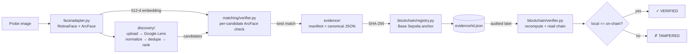

<div align="center">


<br />


### ▶ [**Watch the demo video**](https://drive.google.com/file/d/1NCNKhvYZ182WmfKcNk6eD45sOq4goiHk/view?usp=sharing)

Design notes: [`ARCHITECTURE.md`](ARCHITECTURE.md) · measurements: [`bench/`](bench)

</div>

---

Give FaceProof a photo of a face. It reverse-image-searches the open web, re-verifies
every hit with its own face recognition engine, fingerprints the confirmed result with
SHA-256, and anchors that fingerprint on Base Sepolia. Anyone can re-check the evidence
later against the chain, and any edit to it breaks verification.

## The Problem

Reverse image search tells you an image *looks* related. It does not tell you the face is
the same face, and it gives you nothing you can show someone afterwards. Two gaps:

1. **Similarity is not verification.** "Visually similar" is a ranking signal, not a match.
2. **A finding without integrity is not evidence.** Nothing stops it being edited after
   the fact, and nothing proves when it was produced.

## The Solution

| Step | What FaceProof does |
|---|---|
| **Discover** | Reverse image search returns candidate pages — normalized, deduplicated, ranked. |
| **Verify** | Every candidate image is re-encoded with ArcFace and compared to the probe. Ranking decides only what is *looked at*; it is never evidence of identity. |
| **Fingerprint** | The confirmed evidence package is canonicalised and hashed with SHA-256. |
| **Anchor** | The digest is written to Base Sepolia, timestamped by block. |
| **Audit** | Anyone recomputes the digest and compares it to the chain. Mismatch = modified. |



## How It Works

**1 · Face intelligence** — `faceproof/face/adapter.py` detects with RetinaFace and encodes
with ArcFace (512-d). No face, no run — it aborts before anything is uploaded. The probe
embedding is computed once and reused for every comparison.

**2 · Web discovery** — `faceproof/discovery/` resizes the probe (max 1600 px JPEG, EXIF
stripped), publishes that copy to the host in `FACE_UPLOAD_PROVIDER`, and reverse-searches
it via SerpApi Google Lens. `normalize.py` canonicalises page and image URLs and drops
tracking parameters, never content-selecting ones (`?id=123` and `?id=456` stay distinct).
`candidates.py` merges exact duplicates — keeping the higher-priority one and recording
what it replaced — and ranks the rest: social source `3.0`, cached thumbnail `1.0`,
provider rank decaying to zero by position 25. The full SerpApi response (API key redacted)
is stored in every evidence file, its own SHA-256 bound into the hashed region.

> Ranking is a retrieval optimization, not an identity decision.

**3 · Candidate verification** — `faceproof/matching/verifier.py` downloads each candidate
and compares it against the probe embedding by ArcFace cosine distance, against the
engine's own threshold (`0.68`). Every candidate ends as `MATCH`, `NO_MATCH`, `NO_FACE` or
`DOWNLOAD_FAILED`, and all are shown. `MAX_CANDIDATES` (25) is the ceiling,
`DEMO_CANDIDATES` (10) the interactive default, the UI offers 5–50. Anything below the
budget stays in `not_investigated` with **no status** — uninvestigated is not rejected.
Downloads run on a bounded pool (`FACEPROOF_DOWNLOAD_WORKERS`, 4) ahead of the comparison
loop; comparisons run two at a time (`FACEPROOF_COMPARE_WORKERS`, 2). Both preserve order,
identity and verdicts.

**4 · Explanation** — `matching/explanation.py` exposes distance, threshold, margin, status
and a deterministic reason per verdict.

> The margin is a decision aid derived from the threshold — not a calibrated probability.

**5 · Fingerprint & anchor** — `faceproof/evidence/` builds the manifest, serialises it to
canonical JSON (sorted keys, fixed separators) and takes its SHA-256; only the `evidence`
sub-object is hashed, so anyone can reproduce it from the file.
`faceproof/blockchain/registry.py` writes that 32-byte digest to Base Sepolia (chain ID
`84532`) as the calldata of a 0-value self-transaction. No contract, no ABI, no deploy.

**6 · Independent audit** — `blockchain/verifier.py` re-reads the file, recomputes the
fingerprint, fetches the anchored digest with one `eth_getTransactionByHash`, and compares.
Discovery is never repeated: the evidence stays checkable long after the search is gone.

**7 · Cached replay** — `evidence/replay.py` reconstructs a finished investigation from
`evidence/<id>.json` in ~3 ms with 0 API credits, 0 downloads, 0 inference, 0 gas. It is a
read-only projection with local integrity gates (manifest hash, search-proof hash, matched
image); the on-chain audit stays on `/verify`.

> Blockchain anchoring proves the evidence did not change after anchoring. It does not
> prove the identified person is the real-world identity a source claims.

## Quickstart

Requires Python 3.11 and [uv](https://docs.astral.sh/uv/).

```bash
uv sync
cp .env.example .env      # fill in the values below

# browser UI on http://localhost:8000
uv run flask --app app run --port 8000

# or the CLI, same code path
uv run python -m faceproof run probe.jpg
uv run python -m faceproof verify evidence/<id>.json
```

First run downloads ~130 MB of ArcFace + RetinaFace weights. `verify` exits `0` when it
passes, `1` when it fails. CLI options: `--evidence-dir`, `--max-candidates`, `--model`,
`--detector`.

| Variable | Required | Purpose |
|---|---|---|
| `SERPAPI_API_KEY` | yes | Reverse image search via SerpApi Google Lens. Free tier is enough. |
| `BLOCKCHAIN_PRIVATE_KEY` | yes | Signs the anchor transaction. **Throwaway wallet only**, faucet-funded. |
| `BLOCKCHAIN_RPC_URL` | no | Defaults to `https://sepolia.base.org`. |
| `FACE_UPLOAD_PROVIDER` | no | `catbox` (default), `litterbox` (expires after 1 h), `0x0`. |
| `FACEPROOF_DOWNLOAD_WORKERS` | no | Candidate downloads in flight. Default `4`, clamped 1-8. |
| `FACEPROOF_COMPARE_WORKERS` | no | Candidate comparisons at once. Default `2`, clamped 1-4. Verdicts are identical at every setting. |

`.env` is git-ignored. **Never commit real secrets.**

## Verification Model

A candidate is verified when the ArcFace cosine distance between the probe and candidate
embeddings falls at or below the engine's threshold (`0.68` for ArcFace/cosine).

The distance is a distance, not a probability. FaceProof reports the raw value and the
threshold it was compared against, and never converts either into a confidence percentage.
Verification is a **facial similarity** result plus an **evidence integrity** result — not
a legal identity claim.

## Limitations

- **SerpApi + upload host dependency.** Discovery needs a fetchable probe URL, so a resized
  copy goes to a free anonymous host. Both throttle without notice (`0x0.st` currently
  answers `HTTP 503 uploads disabled`); a failure names the provider and reason.
- **Blocked candidates** are reported as `DOWNLOAD_FAILED`, never silently dropped.
- **Compute cost.** Each candidate costs one download plus one face encode; the budget sets
  the runtime.
- **Testnet only.** Base Sepolia can be reset — this demonstrates the mechanism, it is not
  a production notary.
- **Recall depends on web presence.** No indexed photos, no candidates. Thumbnails make
  distances noisier, so false negatives beat false positives. Only the closest confirmed
  match is anchored.
- **The anchor is not queryable by subject.** You need the transaction hash; a registry
  contract with an indexed event is the upgrade path.

## Security / Privacy

- Keys come from environment variables only, never hardcoded. The UI shows whether a key is
  *set*, never its value. The SerpApi key is redacted from the stored response.
- **The probe briefly leaves your machine** — a resized copy is published so the search
  engine can fetch it. `FACE_UPLOAD_PROVIDER=litterbox` expires it after an hour.
- **Only the 32-byte fingerprint goes on-chain.** No image, no embedding, no personal data.
- Evidence files describe a real person. Use your own face or a public figure, and a
  throwaway wallet with faucet funds.

## Layout

```
app.py              Flask UI - thin shell over pipeline.run / pipeline.audit
templates/          run, verify, evidence, replay pages + components/, fragments/
static/             app.css, app.js - no build step
faceproof/          project layer - the pipeline
  pipeline.py       end-to-end orchestration + CLI
  face/adapter.py   the only module that touches face_engine/
  discovery/        reverse search, URL normalization, ranking, image retrieval
  matching/         candidate verification, ranking, match explanation
  evidence/         manifest, canonical JSON + SHA-256, provenance, cached replay
  blockchain/       anchoring and on-chain fingerprint verification
face_engine/        face-recognition foundation (vendored DeepFace). Unmodified.
bench/              measurement harnesses + the reports they produce
tests/              test_faceproof.py (offline) + upstream DeepFace suite
evidence/           generated at runtime, git-ignored
```

## Tests

```bash
uv run pytest tests/test_faceproof.py -q      # 116 tests, ~30 s
```

Offline only — no network, no TensorFlow. Covers URL normalization, deduplication and
ranking, the candidate budget, concurrent-comparison ordering, credential redaction,
fingerprint canonicalisation, replay integrity, tamper detection, and the anchor
transaction shape. (`tests/unit/` is the upstream DeepFace suite; it needs model weights.)

